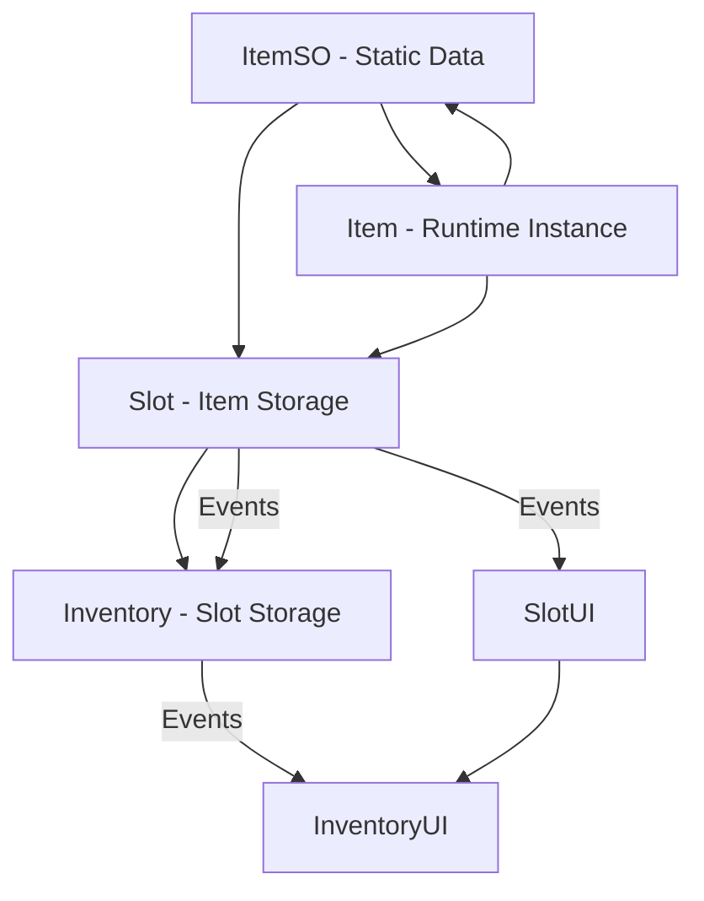

# Inventory System

Event-driven item, slot, and inventory framework with interactive UI support for Unity.

Built to be extended via inheritance and composition for custom item, slot, and inventory behaviors.

---

## Features

### Item

- Create custom `Item<TItemSO>` class types
- Create custom `ItemSO<TItem>` scriptable-object types

---

### Slot

- Create custom `ISlot` class types
- Item containment (based on the cached ItemSO)
- Item stack support
- Event-driven slot updates
- Event-driven UI display
- Drag-and-drop support

---

### Inventory

- Create custom `IInventory or IInventory<TSlot>` class types
- Event-driven inventory updates
- Custom slot construction
- Runtime inventory creation
- UI display

---

## System Architecture Diagram



## Quick Start

### Item & ItemSO Creation

```csharp
public sealed class Fruit : Item<FruitSO> { ... }
public sealed class FruitSO : ItemSO<Fruit> { ... }
```

---

### Inventory Construction

```csharp
Inventory<Slot> inventory = new(m_slotCount, ConstructSlot);

Slot ConstructSlot(int index) => new Slot();
```

#### or

```csharp
Inventory<Slot> inventory = InventoryFactory.EmptySlots<Slot>(m_slotCount);
```

---

### UI Setup

#### Slot

```csharp
ISlot slot = ...;
SlotUI slotUI = ...;

slotUI.SetSlot(slot);
```

#### Inventory

```csharp
IInventory inventory = ...;
InventoryUI inventoryUI = ...;

inventoryUI.SetInventory(inventory);
```

### Event Usage

#### Slot

```csharp
ISlot slot = ...;

// Events
slot.ItemsAdded += OnItemsAdded;
slot.ItemsRemoved += OnItemsRemoved;

slot.Slotted += OnSlotted;
slot.Unslotted += OnUnslotted;

// Handlers
void OnItemsAdded(IReadOnlyList<IItem> items) { ... }
void OnItemsRemoved(IItemSO previousItemSO, IReadOnlyList<IItem> items) { ... }

void OnSlotted(IReadOnlyList<IItem> items) { ... }
void OnUnslotted(IItemSO previousItemSO, IReadOnlyList<IItem> items) { ... }
```

#### Inventory

```csharp
IInventory<TSlot> inventory = ...;

// Events
inventory.ItemsAdded += OnItemsAdded;
inventory.ItemsRemoved += OnItemsRemoved;

inventory.SlotsSlotted += OnSlotsSlotted;
inventory.SlotsUnslotted += OnSlotsUnslotted;

// Handlers
void OnItemsAdded(Dictionary<TSlot, List<IItem>> itemDictionary) { ... }
void OnItemsRemoved(Dictionary<TSlot, List<IItem>> itemDictionary) { ... }

void OnSlotsSlotted(Dictionary<TSlot, List<IItem>> itemDictionary) { ... }
void OnSlotsUnslotted(Dictionary<TSlot, List<IItem>> itemDictionary) { ... }
```

---

## Requirements

- Unity 6000.3+
